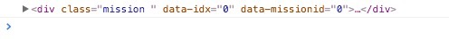

## message list

#### View
这是修bug之前的代码
```javascript
function bindEvent() {
    els.outfits.on('touchstart',hideOutfits);
    els.msgListBd.on(tap,'.mission',function () {
      var missionId = this.getAttribute('data-missionId');
      if(missionId!=0){
        Core.Event.trigger('forwardMissionStyleDetail','mission_id='+missionId);
      }else{
        showOutfits.call(this);
      }
    });
    els.msgListEnd.on(tap, '.more', function () {
      els.msgListBd.find('.item.hide').removeClass('hide');
      Core.Event.trigger('MessageListController.beforeRequestMessageList');
      renderListEnd(els.msgListEnd, '.loading');
    });
  }//end bindEvent

  this.show = function () {
    initResources();

    Core.Event.trigger('trigerAnimate',els.main);
    VIEW._BasicView.show(VIEW.viewCls);
  }
  this.hide = function () {
    if (!els) {
      return;
    }
    hideOutfits();
  }
  function showOutfits(){
    els.outfits.removeClass('hide');
    renderOutfit(this.getAttribute('data-idx'));
  }
  function hideOutfits(){
    els.outfits.addClass('hide');
  }

  function render(data) {
    initResources();
    data = data || VIEW.models.Message.messageList.get();

    if(!data || data.ret != 0 || !data.data){
      return;
    }
    var list = [],
      appendFn = VIEW.models.Message.messageList.page ? 'append' : 'html';
    els.mainMsgs = VIEW.models.Message.messageList.page?els.mainMsgs:[];

    data.data.forEach(function(key) {
      key.old = VIEW.models.Message.messageList.page?'':(key.new?'':'hide');
      key._idx = els.mainMsgs.length;
      key.mission_id = key.mission_id || 0;
      key.user_info.avatar =  !!key.user_info.avatar?key.user_info.avatar:Actions.dejaUserAvatar;
      key._mission_body = key.style && VIEW._StyleTemplateView.getStylesHtm([key.style]);
      list.push(Tpl.msgListItem(key));
      els.mainMsgs.push(key);
    });
    els.msgListBd[appendFn](list.join(''));
    renderListEnd(els.msgListEnd, data.end ? '.end' : '.more');
  }//end render

  function renderOutfit(idx){
    var data = els.mainMsgs[idx];
    if(data.style){
      els.stylesList.html(VIEW._StyleTemplateView.getStylesHtm([data.style]));
      els.occasion.html(Tpl.occasion(data.style));
    }
  }
  function renderListEnd(el,cls){
    el.children().removeClass('show');
    el.find(cls).addClass('show');
  }
```

如果用data-fake-link跳转的话, 要找到需要传递的id，拼到viewquery后面

首先需要注意的是json里一些自己造的字段和DOM里新增的Attribute是处理DOM显示问题的，
e.g. old,主要是用于判断第一页只显示新消息的时候用的；
data-idx用于校准点mission看outfits一一对应的问题，点击的时候只显示idx对应的outfits，具体的方式是定义一个数组，用数组长度来充当idx

#### 修bug之后
然而，因为每次list显示一条新消息之后就没办法查看旧消息了，所以改了代码。
之后又重构了代码，把bind event里的精简成了两个function
```
els.msgListBd.on(tap,'.mission',onClickMission);

els.msgListEnd.on(tap, '.more', onClickListEnd);
```


#### View

```javascript

function bindEvent() {
    els.outfits.on('touchstart',hideOutfits);
    els.msgListBd.on(tap,'.mission',function () {
      var missionId = this.getAttribute('data-missionId');
      if(missionId!=0){
      //这里改为有missionId才会跳转到detail
        Core.Event.trigger('forwardMissionStyleDetail','mission_id='+missionId);
      }else{
      //.call() method的使用 try to avoid undefined situation
      //u can find .call(this) explanation in js.md
        showOutfits.call(this);
        console.log(this)
```
因为之前showOutfits() function也用了this.getAttribute(), 如果不用.call(this)
这个method，console会报错，浮窗outfits会啥也不显示，因为undefined没有取到.mission 所在的DOM 
element，下图是“this” contained content

```javascript
      }
    });
    els.msgListEnd.on(tap, '.more', function () {
      els.msgListBd.find('.item.hide').removeClass('hide');
      if(els.mainData.end){
        renderListEnd(els.msgListEnd, '.end');
      }else{
        Core.Event.trigger('MessageListController.beforeRequestMessageList');
        renderListEnd(els.msgListEnd, '.loading');
      }
    });
  }//end bindEvent

  this.show = function () {
    initResources();

    Core.Event.trigger('trigerAnimate',els.main);
    VIEW._BasicView.show(VIEW.viewCls);
  }
  this.hide = function () {gitgit 
    if (!els) {
      return;
    }
    hideOutfits();
  }
  function showOutfits(){
    els.outfits.removeClass('hide');
    renderOutfit(this.getAttribute('data-idx'));
  }
  function hideOutfits(){
    els.outfits.addClass('hide');
  }

  function render(data) {
    initResources();
    data = data || VIEW.models.Message.messageList.get();

    if(!data || data.ret != 0 || !data.data){
      return;
    }
    var list = [],historyCount = 0,
      appendFn = VIEW.models.Message.messageList.page ? 'append' : 'html';
    els.mainMsgs = VIEW.models.Message.messageList.page?els.mainMsgs:[];
    els.mainData = data;

    data.data.forEach(function(key) {
      if(VIEW.models.Message.messageList.page){
        key.old = '';
      }
      else{
        //hide old item in first page
        if(key.new){
          key.old = '';
          historyCount++;//有几条旧消息最终就是几！！！！！这个位置搞错直接导致一连串懵逼
        }else{
          key.old = 'hide';
        }
      }
      //所以最后新消息old字段为空，旧消息old字段为hide，为了方便第一页render
      key._idx = els.mainMsgs.length;
      key.mission_id = key.mission_id || 0;
      key.user_info.avatar =  !!key.user_info.avatar?key.user_info.avatar:Actions.dejaUserAvatar;
      key._mission_body = key.style && VIEW._StyleTemplateView.getStylesHtm([key.style]);
      list.push(Tpl.msgListItem(key));
      els.mainMsgs.push(key);
    });
    els.msgListBd[appendFn](list.join(''));
    var endCls;
    //注意！！这段要变了
    /**if(VIEW.models.Message.messageList.page){
      endCls = data.end? '.end': '.more';
    }else{
      endCls = historyCount == data.data.length && data.end? '.end': '.more';
      //his和len相等且end=1，return “.end”, 否则".more", 
      //endCls = (historyCount == data.data.length && data.end)? '
      //.end': '.more'; 这样打个括号好理解一点
    }**/
    if(VIEW.models.Message.messageList.page){
          endCls = data.end? '.end': '.more';
        }else{
          if((historyCount == data.data.length)){//如果旧消息和数组长度相等
            //show hide item first
            renderListHideItems();//就显示那些被隐藏的
            endCls = data.end? '.end': '.more';
          }else{
            endCls = '.more';
          }
        }
    renderListEnd(els.msgListEnd, endCls);
  }//end render
  
    function renderListHideItems(){//为了从右下角入口处正常显示all msg...我以前也觉得有问题，但是那时候没有单独的入口所以看不出存在这个问题。
      els.msgListBd.find('.item.hide').removeClass('hide');
    }

  function renderOutfit(idx){
    var data = els.mainMsgs[idx];
    if(data.style){
      els.stylesList.html(VIEW._StyleTemplateView.getStylesHtm([data.style]));
      els.occasion.html(Tpl.occasion(data.style));
    }
  }
  function renderListEnd(el,cls){
    el.children().removeClass('show');
    el.find(cls).addClass('show');
  }

```

#### Controller

```javascript
viewNames = {
    'messagelist': 'New Messages'
  }
  Core.Router.subscribe('/messagelist/', onViewMessageList, unViewMessageList);

  Core.Event.on('MessageListController.beforeRequestMessageList',beforeRequestMessageList);

  //统计视图
  Core.Event.on('analyticsCurView', analyticsCurView);
  //forwardMessageList
  Core.Event.on('forwardMessageList', forwardMessageList);


  function unViewMessageList() {
    CTRL.views.MessageList.hide();
  }

  function onViewMessageList(req){
    curViewId = 'messagelist';
    viewMessageListQuery = req.query;
    Core.Event.trigger('appModifyTitle', viewNames[curViewId]);


    CTRL.views.MessageList.show();
    if(CTRL.models.Message.messageList.timer.isTimeout(0.3)){
    //isTImeout做缓存，时长是5min的倍数，这里是1分半
      CTRL.models.Message.messageList.resetPage();
      beforeRequestMessageList();
    }

    //追加统计
    analyticsCurView();
  }
  function beforeRequestMessageList(){
    CTRL.models.Message.messageList.request({}, afterRequestMessageList);
  }

  function afterRequestMessageList(success){
    CTRL.views.Basic.msgbox.hideLoading();
    var data = CTRL.models.Message.messageList.get();
    if(!success || !data || data.ret!=0 ){
      CTRL.views.Basic.msgbox.showFailed({
        msg: success && data.msg
      });
    }
  }
```
