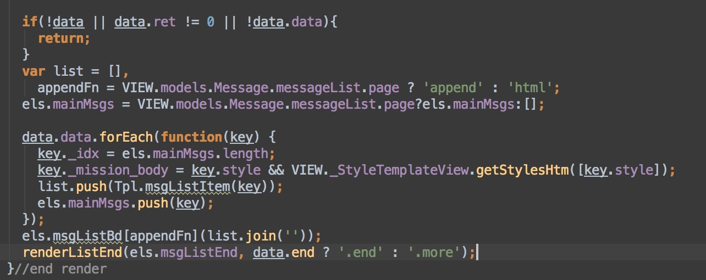
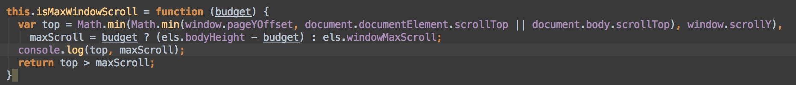

# Dejafm
Taking notes via learning, in this case especially in dejafm encountered problems.
First of all, I'll divided this file into 2 parts, one is cataloged 
by structure: Model, View and Controller，the other one is about 
concrete modules of dejafm project.

#Guide Map
Here's specific modules of dejafm project via generator-webappstarter MVC.
(Updating & organising)


File name | Content
--------- | -------
[StreetSnap](https://github.com/woodghost/notes/blob/master/dejafm/StreetSnap.md) | StreetSnap related content including stylebook, mystreetsnap .etc
[Outfits](https://github.com/woodghost/notes/blob/master/dejafm/Outfits.md)| outfits related content
[v4functions](https://github.com/woodghost/notes/blob/master/dejafm/v4functions.md)| cloth, detail, tabs, cache, location related content in v4.0
[inspire_jsonp](https://github.com/woodghost/notes/blob/master/dejafm/inspire_jsonp.md)| street snap images display via DDMS using JSONP tech
[Mission](https://github.com/woodghost/notes/blob/master/dejafm/Mission.md)| my mission list & my mission detail     
[MessageList](https://github.com/woodghost/notes/blob/master/dejafm/MessageList.md)| message list in deja3.2 share wardrobe 
[slider](https://github.com/woodghost/notes/blob/master/dejafm/slider.md)| slider plugin in MVC structure under util folder 


## MVC processing
最早的电影list也是在此处render

#### 观察者机制  observer
- controller直接引入（访问）model
- controller直接引入（访问）view
- view直接引入（访问）model
- view通过call Event（notify）到 controller //model 是不能直接引入其他model的
- model通过call Event（notify）到 controller    //e.g. Core.Event.trigger(‘ ’)
- model通过call Event（notify）到 view

Pubsub   机制（一种广播机制）
model遵循单一性原则（function model 一一对应）


#### Inspect element常用
```javascript
Core.Router.run()     刷新页面
Core.Event.trigger(‘back’)   返回上页
Core.Event.trigger(‘forwardModuleName’)  //一种调用事件call event 的通知notify机制
Core.Event.trigger('login')
```

#### Key Door原则
每当遇到模块未添加成功
手动添加三个文件上面的声明

1. views.html
2. _debug-view.scss
3. App.js


Ajax和template共同作用在data里面模拟数据
所有步骤都可以分三步考虑：（这个叫契约）

* before    定义声明
* on     执行时刻
* after   传递数据...

#### Model:
1. Action(在resource里面)  分为official和debug  添加你想引入的数据源（url）
2. topicList  model( is a template, 写在special里面，但是这种做法不符合单一性对应原则，应该创建独立模块，详情下面MVC学习)

观察者机制
>controller直接引入（访问）model
>controller直接引入（访问）view
>view直接引入（访问）model
>view通过call Event（notify）到 controller   `Core.Event.trigger(‘functionName’, args)`有参数就传没有就不传
>model通过call Event（notify）到 controller
>model通过call Event（notify）到 view

```javascript
Special.prototype.topicList = new Mdl({
//  request: function (data, callback) 

{
//    RequestHelper.request(Actions.topicList, data, callback, this); //向后台发送request
//  }
//});
```
3. RequestHelper（看一下里面的结构）


#### Controller(发请求，控制逻辑都是在controller里面的)
接下来是controller

1.  引入model
2. this.models 声明
3. 数据写在data/topiclist.json里面，ajax afterRequestXxxxxx方法传入
4. 数据在DDMS上或者后端传入，定义全局callback方法那样传入
5. 写你需要用的方法。

一定要在onView方法里面调用你写的方法
```javascript
function afterRequestTopicList(success){//console.log(CTRL.models.Special.topicList.get());
       
}
   CTRL.models.Special.topicList.request(null,afterRequestTopicList);
           用到的解析数据的方法是Ajax   afterRequestTopicList

CTRL.models.Special.topicList.request({id: 
'56209a49cee3c65f0fbdfd20'},afterRequestTopicList);//request方法，从DDMS里读数据，使用id
```
#### Viewer(render&bind event)
1. 引入model
2. this.model declaration
3. model listener update 方法  VIEW.models.Creation.creation.updated(render);

4. els(elements)  main.find method  creation: main.find('.creation'),

5. render里面解析数据

```javascript
function render(data) {
  
initResources();
  
data = data || VIEW.models.Movie.movieList.get();   // 1. data =  2. get() method.
  
var list = [];
  //data = data.data.schemata;
  
data.data.schemata.forEach(function(val){
    
var d = {};
    d['title'] = val.name;
    
d['desc'] = val.title;
    
val.child.forEach(function(val){

      d[val.name] = val.title;//name:name    title:value

          });
          
    list.push(Tpl.movieList(d));
    //console.log(d);
  
          });
  
          els.movieList.html( list.join('') );
data.forEach(function (key) {
key传的是一个object，具体来讲就是json里面的模拟数据
});
```


JSONP读数据和AJAX异步不一样

JSONP is JSON with padding, that is, you put a string at the beginning and a pair of parenthesis around it. For example:
```javascript
//JSON
{"name":"stackoverflow","id":5}
//JSONP
func({"name":"stackoverflow","id":5});
```
For more info: http://stackoverflow.com/questions/2887209/what-are-the-differences-between-json-and-jsonp?answertab=oldest#tab-top

JSONP allows you to specify a callback function that is passed your JSON object. 
This allows you to bypass the same origin policy and load JSON from an external server into the javascript on your webpage.
http://json-jsonp-tutorial.craic.com/index.html


## Model & Controller related
关于model 与 controller
### 打开了Controller 以及回调客户端方法的大门
现在要做一个缓存，应该是满足他点进detail页面之后原来的页面上有一些缓存的数据
（为了返回的时候记住位置？）因为你点过去之后页面其实不刷新。
想做这个的话好好研究一下cloth module

//这也是一种做缓存的方式（虽然我还不是完全明白）合理的情况应该是从detail页返回时page不refresh也不改变


//另一种做缓存的方式
//cloth

var clothStoreData = CTRL.models.Cloth.clothDetail.getFromStoreById(viewClothQuery.id),
  clothCurData = CTRL.models.Cloth.clothDetail.get();
if (clothStoreData && clothCurData) {
  clothCurData.__STORE_ID != clothStoreData.__STORE_ID
  && CTRL.models.Cloth.clothDetail.set(clothStoreData, viewClothQuery.id);
} else {
  //CTRL.views.Basic.msgbox.showLoading();
  CTRL.models.Cloth.clothDetail.request({
    __STORE_ID: viewClothQuery.id,
    cloth_id: viewClothQuery.id
  }, afterRequestClothDetail);
}
//streets
var streetsStoreData = CTRL.models.StreetSnap.clothStreets.getFromStoreById(viewClothQuery.id),
  streetsCurData = CTRL.models.StreetSnap.clothStreets.get();
if (streetsStoreData && streetsCurData) {
  streetsCurData.__STORE_ID != streetsStoreData.__STORE_ID && CTRL.models.StreetSnap.clothStreets.setWithStoreData(streetsStoreData);
//Model里面必须写setWithStoreData function
} else {
  CTRL.models.StreetSnap.clothStreets.resetPage();
  beforeRequestClothStreet();
}
//所有tips，firstAlert，都需要做一下localStorage
e.g. var tipId = 'cloth_tip_' + VIEW.models.Basic.getUserId();

Core.localStorage.set(tipId, new Date().getTime());


model是写了来连接后台api，来拿数据用的。
经常在controller里面调的post，request，resetPage（分页时）之类的方法都是你每次为了取数据而直接写在model里面的。

然而，get，updated， set，这种方法是model里面的固有方法，方便你在controller，view里面操作数据。

要给后台拼concat什么数据传过去，都是在controller里面实现的
要执行什么，一定要写在onView里面

controller里面事件名称要一致, onView function的效果和beforeXxxx 
function是一样的，你要是写了before function，必须在onView里面调用才能生效，等同于你不写before 
function直接把语句写在onView方法里。

```javascript
`Core.Event.on('MessageListController.beforeRequestMessageList',beforeRequestMessageList);`
//感觉写这个就是为了view里面可以trigger
//
你这里叫MessageListController.beforeRequestMessageList
之后在view里面调用的时候也要是一样的名字，要不然没法trigger

function beforeRequestStyleReviewHistory(item) {

  var ids = [];

  item.clothes.forEach(function(key){

    ids.push(key.id);

  });

  var data = {

    cloth_ids: ids.join(',')

  };
  CTRL.models.Style.styleReviewHistory.request(data)

 }
controller里面可以接收view传过来的参数，然后再把拼起来的data传给后台server。
包括下面这个防止出错的msgbox也是从其他地方传来了success这个参数，防止没有请求成功数据之类的……

function afterRequestMissionDetailInfo(success){

  CTRL.views.Basic.msgbox.hideLoading();
  
  var data = CTRL.models.Mission.missionStyleDetailList.get();
  
  if (!success || !data || data.ret != 0) {
  
    CTRL.views.Basic.msgbox.showFailed({
  
      msg: success && data.msg
  
    });
  
  }
}
```

分页的时候controller onView里面要调一下`resetPage()` method

## View render & bind event (and a little about Controller `Core.Event.trigger()`)
#### CTRL：controller里面事件名称要一致
```javascript
Core.Event.on('MessageListController.beforeRequestMessageList',beforeRequestMessageList);

你这里叫'MessageListController.beforeRequestMessageList'，之后在view里面调用的时候也要是一样的名字，要不然没法调用
```

你想了很久很久的数据结构改变怎么重新渲染的问题。
你可以改html里面的数据结构。
```html
比如
<div class="mission <%=_mission_body?'':'hide'%>" 
data-idx="<%=_idx%>">
">
<div class="occasion-name">Occasion: <%=occasions.name%></div>
<div class="name"><%=user_info.name%></div>

你没必要非得在view render里面解析到那一层结构，在html里面直接改分分钟找到啊
```

你可以在view里拼所有你想要的order，structure，方便你渲染，方便你使用
for example，这个message list里面有个地方创建了data-idx attribute，我们自己拼一个_idx,在渲染的时候取这个值来使用
还有渲染outfits，就是那个style template，outfits view里面是取data-element属性然后填进去，你照样也可以拼出html结构然后填进去

```javascript
function showOutfits(){
  
els.outfits.removeClass('hide');
  
renderOutfit(this.getAttribute('data-idx'));

}

function hideOutfits(){
  
els.outfits.addClass('hide');
}

function render(data) {
  
initResources();
  data = data || VIEW.models.Message.messageList.get();

  
if(!data || data.ret != 0 || !data.data){

    return;

  }

    var list = [];
  
els.mainMsgs = VIEW.models.Message.messageList.page?els.mainMsgs:[];  //自己创建一个数组，保证分页之后idx会继续往下数不会清空。
```
（这种容错的措施真的是依情况而定，经验越丰富解决这类问题几率越高）


要是一开始就设置成空数组，翻了页之后归零了，没办法正确计数。（图为容错之后的正确情况）
```javascript
appendFn = VIEW.models.Message.messageList.page ? 'append' : 'html';
这句话是解决第一个tpl没有被渲染的情况



这个idx呢，是在render的时候用数组长度拼，拼起来作为Attribute放到html里，再取回来传给要render的function当param使用。
  
data.data.forEach(function(key) {
    
key._idx = els.mainMsgs.length; //数组的长度
    
key._mission_body = key.style && VIEW._StyleTemplateView.getStylesHtm([key.style]);
    
list.push(Tpl.msgListItem(key));
    
els.mainMsgs.push(key);//每一个遍历过的object都push进数组里面，方便计数。
  
});
  
els.msgListBd.append(list.join(''));
  
renderListEnd(els.msgListEnd, data.end ? '.end' : '.more');
}//end render



function renderOutfit(idx){
 
 var data = els.mainMsgs[idx];
  if(data.style){
    
 els.stylesList.html(VIEW._StyleTemplateView.getStylesHtm([data.style]));
    
 els.occasion.html(Tpl.occasion(data.style));
 
  }

 }

 
 function renderListEnd(el,cls){
  
 el.children().removeClass('show');
  
 el.find(cls).addClass('show');
 
}
 
```
>当你需要在view里面trigger controller里面的方法，首先要在controller里面写Core.Event.on();
 算是打开（声明）要调用这个方法。
>熟练渲染对象，数组，数组遍历，对象填到html，数组push到html()

#### controller
```javascript
function beforeRequestStyleReviewHistory(item) {
  
var ids = [];
  item.clothes.forEach(function(key){
    
ids.push(key.id);
  });
  var data = {
    
cloth_ids: ids.join(',')
  };
  
CTRL.models.Style.styleReviewHistory.request(data)
}
```
data.data是一个数组，所以用forEach做循环遍历，里面的key则是object，idx就是下标。
```javascript
function render(data) {
  initResources();
  data = data || VIEW.models.Movie.movieList.get();   
// 1. data =  2. get() method.
  
var list = [];
  
//data = data.data.schemata;
  
data.data.schemata.forEach(function(val){
    
var d = {};

    d['title'] = val.name;

    d['desc'] = val.title;

      val.child.forEach(function(val){

           d[val.name] = val.title;    //name:name    title:value

               });
    
 list.push(Tpl.movieList(d));//这个template里面放的是一个对象。
    
 //console.log(d);
 
  });
 
  els.movieList.html( list.join('') );
```
这个是以前DDMS里面生成的数据结构，里面的弯弯绕的解析很值得多加练习多多熟悉
```javascript
data.forEach(function (key) {
key传的是一个object，具体来讲就是json里面的数据
});
```

```javascript
function hideGuideTip1() {
  els.guideTip1 && els.guideTip1.hide();
}
因为els.body.on('touchstart',hideGuideTip); 是在window的点击。为了防止找不到之后报错，要容错一下。
```


### ToolTips.js
###### 2016.3.9
```javascript
var tipId = 'cloth_tip_' + VIEW.models.Basic.getUserId();
    if(!els.guideTip && !Core.localStorage.get(tipId)){
      els.guideTip = new Tooltip({
        body: '<i class="icon icon-arrow"></i>' + '<p>scroll up to see the street snaps</p>',
        bottom: 30,
        left: 140,
        rootCls: 'black',
        bodyCls: 'view-cloth-guide-tip box-h-c-c',
        autoShow: true,
        showDelay: 1000,
        autoHide: false
      });
      Core.localStorage.set(tipId, new Date().getTime());
    }
```

`var tipId = 'cloth_tip_' + VIEW.models.Basic.getUserId();` and `Core
.localStorage.set(tipId, new Date().getTime());` are for cache storage.

### ClothView.js & StyleBook.js
##### About auto-loading pictures

```javascript
    this.resizeCalculateWindow = function () {
        els.window = $(window);
        els.body = $('body');
        setTimeout(function () {
          els.bodyHeight = els.body.height();
          els.windowMaxScroll = els.bodyHeight - els.window.height() * 2;
        }, 300);
      }
    
      this.isMaxWindowScroll = function (budget) {
        var top = Math.min(Math.min(window.pageYOffset, document.documentElement.scrollTop || document.body.scrollTop), window.scrollY),
          maxScroll = budget ? (els.bodyHeight - budget) : els.windowMaxScroll;
    
        return top > maxScroll;
      }
```
1. If you are trying to find out why the code segment do not work, try
 to put more `console.log()` in ur functions and to watch whether 
 they print or not.
 
```javascript
         }
       } else {
         loadingNextPageClothStreet();
       }
     }
   }
```
 Try to use `console.log(scroll)` or  `console.log(top, maxScroll)` to 
 discover what stuffs are in these arguments.(Just because the 
 function didn't come from my code :( ).
 
2. Put logs in appropriate locations to detect which sentence is not 
executed(e.g is in above segment)

3. Need to adopt into favorite outfits list, should change all 
functions' and parameters' names.

